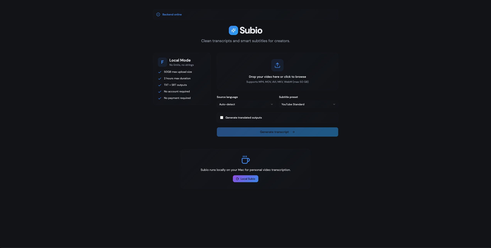

# Sub-IO

Sub-IO is a local-first subtitle transcription and translation tool.

It helps you upload video or audio files, generate subtitles, translate subtitles, review the result, and export subtitle files.

## Screenshot

## Main idea

Sub-IO is designed to run locally on your own machine.

It uses a BYOK model: Bring Your Own Key.

This means the repository does not include any OpenAI API key. Each user must provide their own API key locally through an .env file.

## Key principles

- Local-first
- BYOK: Bring Your Own Key
- No API key included
- No hosted backend by default
- No user accounts
- No subscriptions
- No payments
- No analytics
- No ads

## Project structure

Sub-IO/
- subio-backend/
- subio-frontend/
- README.md
- .gitignore

## Requirements

You need:

- Python 3.10+
- Node.js
- npm
- FFmpeg
- Your own OpenAI API key

## Backend setup

Go to the backend folder:

cd subio-backend

Create your local environment file:

cp .env.example .env

Open .env and add your own OpenAI API key:

OPENAI_API_KEY=your_openai_api_key_here
OPENAI_MODEL=gpt-4.1-mini
ENABLE_TRANSLATION=true

Install and run:

python3 -m venv .venv
source .venv/bin/activate
pip install -r requirements.txt
uvicorn app.main:app --reload --host 127.0.0.1 --port 8000

## Frontend setup

Go to the frontend folder:

cd subio-frontend

Create your local environment file:

cp .env.example .env

Install and run:

npm install
npm run dev

Then open the local frontend URL shown in your terminal.

Usually it will be:

http://localhost:5173

## Security

Never commit your .env file.

Never expose your OpenAI API key in frontend code.

Sub-IO does not include any OpenAI API key.

Your API usage and costs are billed to your own OpenAI account.

## Disclaimer

Sub-IO is an experimental local tool.

Please review generated and translated subtitles before using them professionally or publishing them.
